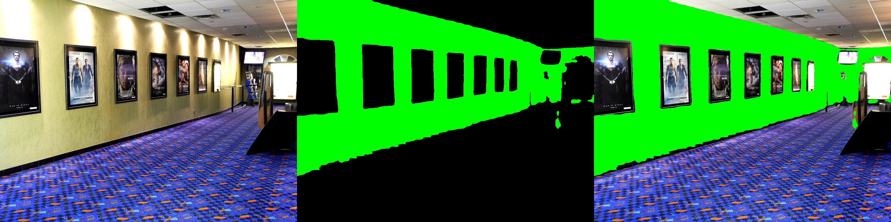

*Note 1: Original repo can be found [here](https://github.com/bjekic/WallSegmentation)*

*Note 2: Weights can be found [here](https://drive.google.com/drive/folders/1xh-MBuALwvNNFnLe-eofZU_wn8y3ZxJg?usp=sharing)*

*How to use:*

```python
from pathlib import Path

import numpy as np
import torch
from PIL import Image

import wallsegmenter as wallseg

device = "cuda" if torch.cuda.is_available() else "cpu"

weights_dir = Path("weights")

segmenter = wallseg.build_segmenter(
    weights_dir / "resnet50_imagenet.pth",
    weights_dir / "wall_encoder_epoch_20.pth",
    weights_dir / "wall_decoder_epoch_20.pth",
    device,
    train_only_wall=True,
)

img_path = Path("room.jpeg")
img = Image.open(img_path).convert("RGB")

pred = wallseg.segment_image(segmenter, img, device)

wallseg.visualize_wall(np.asarray(img), pred)
```


